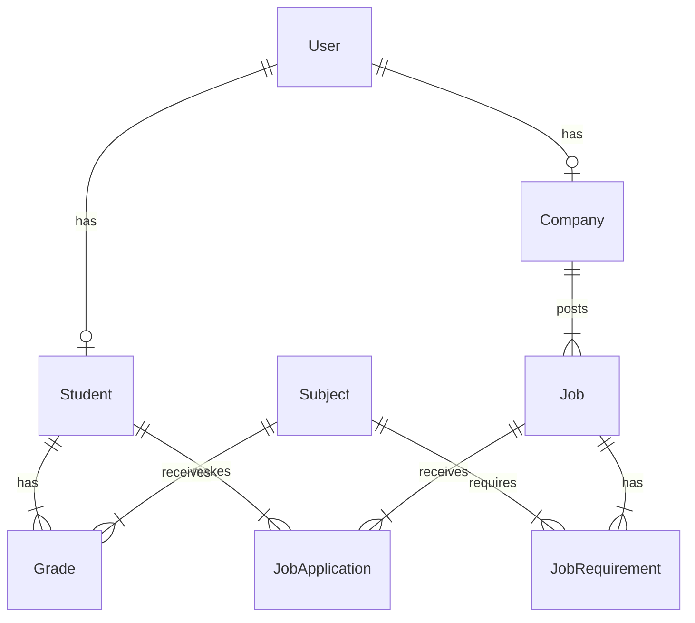

# 🎓 Faculty Career Matching System

Sistema inteligente que conecta o desempenho acadêmico dos alunos (notas por disciplina) com oportunidades de emprego de empresas parceiras da faculdade.

## 📋 Visão Geral

Este sistema FastAPI resolve o problema de **matching** entre alunos e vagas de emprego baseado em critérios acadêmicos específicos. As empresas podem definir requisitos de notas por disciplina e o sistema automaticamente:

- ✅ Calcula compatibilidade entre alunos e vagas
- ✅ Recomenda as melhores oportunidades para cada aluno
- ✅ Identifica os candidatos mais qualificados para cada vaga
- ✅ Fornece analytics detalhados sobre matching

## 🚀 Funcionalidades Principais

### 1. Gestão de Alunos
- Cadastro de alunos com perfil acadêmico
- Registro de notas por disciplina
- Cálculo automático de GPA
- Acompanhamento de desempenho por categoria

### 2. Gestão de Empresas e Vagas
- Cadastro de empresas parceiras
- Criação de vagas com requisitos específicos
- Definição de notas mínimas por disciplina
- Gestão de candidaturas

### 3. Sistema de Matching Inteligente 🎯

**Algoritmo de Pontuação Ponderada:**
- **55%** - Disciplinas Específicas (notas em matérias requeridas)
- **20%** - GPA Geral
- **15%** - Compatibilidade de Curso
- **10%** - Semestre Mínimo

### 4. Analytics e Insights
- Performance acadêmica por categoria
- Análise de compatibilidade aluno-vaga
- Identificação de gaps em requisitos
- Estatísticas por disciplina

## 🏗️ Arquitetura

```
faculdade_career_matching/
├── src/
│   ├── main.py                    # FastAPI app
│   ├── models/
│   │   └── models.py              # SQLAlchemy models
│   ├── schemas/
│   │   ├── student.py             # Pydantic schemas
│   │   ├── company.py
│   │   ├── job.py
│   │   └── subject.py
│   ├── services/
│   │   ├── student_service.py     # Business logic
│   │   ├── job_service.py
│   │   ├── subject_service.py
│   │   └── matching_service.py    # 🎯 Algoritmo de matching
│   ├── api/
│   │   └── routes/
│   │       ├── student_routes.py
│   │       ├── company_routes.py
│   │       ├── job_routes.py
│   │       ├── subject_routes.py
│   │       └── matching_routes.py # 🎯 Endpoints de matching
│   ├── config/
│   │   └── database.py
│   └── utils/
│       └── seed_data.py           # Dados de exemplo
├── requirements.txt
├── Dockerfile
└── docker-compose.yml
```

## 🔧 Instalação e Execução

### Opção 1: Docker (Recomendado)

```bash
# Build da imagem
docker build -t faculty-matching .

# Executar container
docker run -p 8000:8000 faculty-matching

# Ou usar docker-compose
docker-compose up
```

### Opção 2: Local

```bash
# Criar ambiente virtual
python -m venv venv
source venv/bin/activate  # Linux/Mac
# ou
venv\Scripts\activate  # Windows

# Instalar dependências
pip install -r requirements.txt

# Executar aplicação
uvicorn src.main:app --reload --host 0.0.0.0 --port 8000
```

### Carregar Dados de Exemplo

```bash
python -m src.utils.seed_data
```

## 📚 Documentação da API

Após iniciar o servidor, acesse:

- **Swagger UI**: http://localhost:8000/docs
- **ReDoc**: http://localhost:8000/redoc
- **API Info**: http://localhost:8000/api/v1/info

## 🎯 Exemplos de Uso

### 1. Criar um Aluno

```bash
curl -X POST "http://localhost:8000/api/v1/students" \
  -H "Content-Type: application/json" \
  -d '{
    "email": "aluno@university.edu",
    "password": "senha123",
    "registration_number": "2024001",
    "full_name": "Ana Costa",
    "course": "Ciência da Computação",
    "semester": 4,
    "skills": "Python, JavaScript, SQL"
  }'
```

### 2. Adicionar Notas

```bash
curl -X POST "http://localhost:8000/api/v1/students/1/grades" \
  -H "Content-Type: application/json" \
  -d '{
    "subject_id": 1,
    "grade": 9.0,
    "semester_year": "2024.1"
  }'
```

### 3. Criar Vaga de Emprego

```bash
curl -X POST "http://localhost:8000/api/v1/jobs?company_id=1" \
  -H "Content-Type: application/json" \
  -d '{
    "title": "Desenvolvedor Python Júnior",
    "description": "Vaga para desenvolvedor Python",
    "minimum_gpa": 7.0,
    "minimum_semester": 3,
    "job_type": "junior",
    "work_type": "remote",
    "salary_range": "R$ 4.000 - R$ 6.000",
    "subject_requirements": [
      {
        "subject_id": 1,
        "minimum_grade": 8.0,
        "weight": 2.0,
        "is_mandatory": true
      }
    ]
  }'
```

### 4. Buscar Vagas Recomendadas para Aluno 🎯

```bash
curl "http://localhost:8000/api/v1/matching/student/1/recommended-jobs?min_score=60&limit=5"
```

**Resposta:**
```json
[
  {
    "job_id": 1,
    "job_title": "Desenvolvedor Backend Júnior",
    "company_name": "Tech Solutions Brasil",
    "match_score": 85.5,
    "match_percentage": 92.3,
    "location": "São Paulo, SP (Híbrido)",
    "work_type": "hybrid",
    "salary_range": "R$ 3.500 - R$ 5.000",
    "matched_subjects": [
      {
        "subject_code": "CS202",
        "subject_name": "Banco de Dados",
        "required_grade": 7.5,
        "student_grade": 8.5,
        "met": true
      }
    ],
    "gpa_match": true,
    "semester_match": true,
    "course_match": true,
    "recommendation_reason": "GPA (8.2) meets requirement; Course matches preferred courses; 3/3 required subjects met (100%)"
  }
]
```

### 5. Buscar Candidatos para Vaga 🎯

```bash
curl "http://localhost:8000/api/v1/matching/job/1/recommended-candidates?min_score=70&limit=10"
```

### 6. Calcular Match Específico

```bash
curl "http://localhost:8000/api/v1/matching/calculate/1/1"
```

## 🌐 APIs Gratuitas para Integração

### 1. LinkedIn API (Perfis Profissionais)
- **URL**: https://www.linkedin.com/developers/
- **Uso**: Enriquecer perfis de alunos com dados do LinkedIn
- **Free Tier**: Acesso limitado a dados públicos
- **Integração**:
  ```python
  # Buscar dados do LinkedIn pelo URL do perfil
  GET https://api.linkedin.com/v2/people/(id)
  ```

### 2. GitHub API (Portfólio de Código)
- **URL**: https://api.github.com
- **Uso**: Avaliar repositórios e atividade de código dos alunos
- **Free Tier**: 60 requests/hora (não autenticado), 5000/hora (autenticado)
- **Integração**:
  ```python
  # Buscar repositórios do aluno
  GET https://api.github.com/users/{username}/repos
  
  # Analisar linguagens mais usadas
  GET https://api.github.com/users/{username}/repos
  ```

### 3. ReclameAQUI API (Reputação de Empresas)
- **URL**: https://RA1000.reclameaqui.com.br/api
- **Uso**: Verificar reputação de empresas parceiras
- **Dados**: Índice de reclamações, respostas, reputação
- **Integração**:
  ```python
  # Buscar reputação da empresa
  GET https://RA1000.reclameaqui.com.br/api/company/{cnpj}
  ```

### 4. ViaCEP (Endereços)
- **URL**: https://viacep.com.br
- **Uso**: Autocompletar endereços de empresas
- **Free Tier**: Ilimitado
- **Integração**:
  ```python
  GET https://viacep.com.br/ws/{cep}/json/
  ```

### 5. Brasil API (Dados Brasil)
- **URL**: https://brasilapi.com.br
- **Uso**: Validar CNPJs, buscar bancos, feriados
- **Free Tier**: Ilimitado
- **Integração**:
  ```python
  # Validar CNPJ da empresa
  GET https://brasilapi.com.br/api/cnpj/v1/{cnpj}
  
  # Buscar dados bancários
  GET https://brasilapi.com.br/api/banks/v1
  ```

### 6. OpenAI API (Análise de Currículo/Match)
- **URL**: https://platform.openai.com/docs/api-reference
- **Uso**: Melhorar algoritmo de matching com IA
- **Free Tier**: $5 de crédito inicial
- **Integração**:
  ```python
  # Analisar compatibilidade aluno-vaga com GPT
  POST https://api.openai.com/v1/chat/completions
  {
    "model": "gpt-3.5-turbo",
    "messages": [
      {
        "role": "system",
        "content": "Você é um especialista em recrutamento técnico."
      },
      {
        "role": "user",
        "content": "Analise a compatibilidade entre este aluno e esta vaga..."
      }
    ]
  }
  ```

### 7. Google Jobs API (Comparação de Mercado)
- **URL**: https://developers.google.com/search/docs/advanced/structured-data/job-posting
- **Uso**: Comparar salários e requisitos com mercado
- **Alternativa**: SerpAPI (https://serpapi.com) - Free tier: 100 searches/mês

### 8. Abstract API (Validações)
- **URL**: https://www.abstractapi.com
- **Uso**: Validar emails, telefones, IPs
- **Free Tier**: 
  - Email Validation: 100/mês
  - Phone Validation: 250/mês
- **Integração**:
  ```python
  # Validar email do aluno
  GET https://emailvalidation.abstractapi.com/v1/?api_key=YOUR_KEY&email=test@test.com
  ```

### 9. Clearbit API (Enriquecimento de Empresas)
- **URL**: https://clearbit.com/enrichment
- **Uso**: Obter logos, descrições e dados de empresas
- **Free Tier**: 50 requests/mês
- **Integração**:
  ```python
  # Buscar dados da empresa por domínio
  GET https://company.clearbit.com/v2/companies/find?domain=company.com
  ```

### 10. IPInfo (Geolocalização)
- **URL**: https://ipinfo.io
- **Uso**: Sugerir vagas por proximidade
- **Free Tier**: 50k requests/mês
- **Integração**:
  ```python
  GET https://ipinfo.io/{ip}/json
  ```

## 🔄 Exemplos de Integração

### Exemplo 1: Enriquecer Perfil com GitHub

```python
import requests

def enrich_student_profile(github_username: str):
    """Buscar dados do GitHub do aluno"""
    response = requests.get(f"https://api.github.com/users/{github_username}")
    
    if response.status_code == 200:
        data = response.json()
        return {
            "total_repos": data.get("public_repos", 0),
            "followers": data.get("followers", 0),
            "bio": data.get("bio"),
            "company": data.get("company")
        }
    return None

# Buscar linguagens mais usadas
def get_student_languages(github_username: str):
    """Analisar linguagens de programação do aluno"""
    repos_response = requests.get(f"https://api.github.com/users/{github_username}/repos")
    
    if repos_response.status_code == 200:
        repos = repos_response.json()
        languages = {}
        
        for repo in repos:
            if repo.get("language"):
                lang = repo["language"]
                languages[lang] = languages.get(lang, 0) + 1
        
        return languages
    return {}
```

### Exemplo 2: Validar CNPJ da Empresa

```python
import requests

def validate_company_cnpj(cnpj: str):
    """Validar e enriquecer dados da empresa via Brasil API"""
    # Remover formatação
    cnpj_clean = cnpj.replace(".", "").replace("/", "").replace("-", "")
    
    response = requests.get(f"https://brasilapi.com.br/api/cnpj/v1/{cnpj_clean}")
    
    if response.status_code == 200:
        data = response.json()
        return {
            "valid": True,
            "company_name": data.get("razao_social"),
            "fantasy_name": data.get("nome_fantasia"),
            "address": f"{data.get('logradouro')}, {data.get('numero')}",
            "city": data.get("municipio"),
            "state": data.get("uf"),
            "zip_code": data.get("cep"),
            "activity": data.get("cnae_fiscal_descricao")
        }
    
    return {"valid": False}
```

### Exemplo 3: Melhorar Matching com IA

```python
import openai

def ai_enhanced_matching(student_profile: dict, job_description: dict):
    """Usar GPT para análise qualitativa de compatibilidade"""
    
    prompt = f"""
    Analise a compatibilidade entre este aluno e esta vaga:
    
    ALUNO:
    - Nome: {student_profile['name']}
    - Curso: {student_profile['course']}
    - GPA: {student_profile['gpa']}
    - Skills: {student_profile['skills']}
    - GitHub: {student_profile.get('github_stats', 'N/A')}
    
    VAGA:
    - Título: {job_description['title']}
    - Empresa: {job_description['company']}
    - Requisitos: {job_description['requirements']}
    - Tipo: {job_description['job_type']}
    
    Forneça uma análise em 3 pontos:
    1. Pontos fortes do match
    2. Pontos de atenção
    3. Recomendação final (Altamente compatível / Compatível / Pouco compatível)
    """
    
    response = openai.ChatCompletion.create(
        model="gpt-3.5-turbo",
        messages=[
            {"role": "system", "content": "Você é um especialista em recrutamento de TI."},
            {"role": "user", "content": prompt}
        ]
    )
    
    return response.choices[0].message.content
```

## 📊 Schema do Banco de Dados



## 🎨 Melhorias Futuras

- [ ] Sistema de notificações (email/SMS)
- [ ] Dashboard visual com gráficos
- [ ] Integração com LinkedIn para importar perfis
- [ ] Sistema de recomendações com Machine Learning
- [ ] API de relatórios em PDF
- [ ] Sistema de agendamento de entrevistas
- [ ] Chat entre empresa e candidato
- [ ] Testes automatizados com mock das APIs

## 🤝 Contribuindo

1. Fork o projeto
2. Crie uma branch para sua feature (`git checkout -b feature/AmazingFeature`)
3. Commit suas mudanças (`git commit -m 'Add some AmazingFeature'`)
4. Push para a branch (`git push origin feature/AmazingFeature`)
5. Abra um Pull Request

## 📝 Licença

Este projeto está sob a licença MIT.

## 👨‍💻 Autor

Desenvolvido como sistema de matching acadêmico-profissional para faculdades.

## 📞 Suporte

Para dúvidas e suporte:
- 📧 Email: support@facultycareer.com
- 📚 Docs: http://localhost:8000/docs

---

**⭐ Se este projeto foi útil, considere dar uma estrela no GitHub!**
